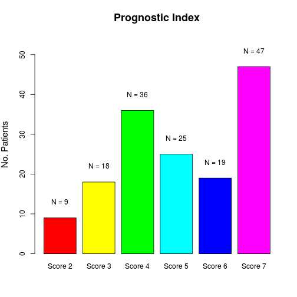
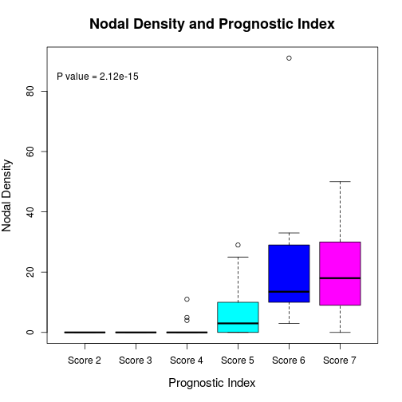

# Nodal Density in Penile Cancer

__Title:__ High Nodal Density Is Associated with Aggressive Pathologic Features and Predicts Outcome in Patients with Penile Squamous Cell Carcinoma Treated by Penectomy and Inguinal Lymphadenectomy

__List of Authors:__ Isabel Alvarado,<sup>1</sup>  César Aponte,<sup>2</sup>, Diana Piedras,<sup>1</sup> Adriana Rodriguez-Gómez,<sup>1</sup> Diego F Sanchez,<sup>3</sup> Narciso Hernández-Toriz,<sup>1</sup> Antonio L. Cubilla,<sup>3</sup> and  Alcides Chaux<sup>2</sup>

<sup>1</sup> Servicio de Anatomía Patológica, Hospital de Oncología, Centro Médico Nacional Siglo XXI, Instituto Mexicano del Seguro Social, México D.F.  
<sup>2</sup> Office of Scientific Research, Norte University, Asunción, Paraguay  
<sup>3</sup> Instituto de Patología e Investigación, Facultad de Ciencias Medicas,  Asunción, Paraguay

***

Last update: ``Fri Sep 19 08:18:52 2014``


```r
# Setting the global options for the analysis
library(knitr)
opts_chunk$set(echo = FALSE, message = FALSE, warning = FALSE)
```


***

### Abstract

__Background:__ Proper clinical management of patients with penile squamous cell carcinomas (SCC) is hampered by its rarity in developed nations and by the lack of sufficiently large series with adequate follow-up. Aimed to solve this issue several pathologic features have been proposed as prognostic factors. Recently, nodal density (defined as the ratio of positive inguinal lymph nodes over the total number of inguinal lymph nodes) has been identified as a promising tool to define the outcome of patients with penile SCC. In this study, we evaluate the usefulness of nodal density as a predictor of aggressive pathologic features and outcome in a large series of patients with penile SCC.

__Design:__ This study includes 154 patients with invasive penile SCC treated by penectomy, of whom 133 received a bilateral inguinal lymphadenectomy. The number of lymph nodes per patient that were pathologically evaluated ranged from 1 to 27 for each side, with a median of 8 lymph nodes per side per patient. Clinical endpoints included cancer-free survival and cancer-specific death. Patients were followed  from 11 to 82 months (mean of 54.2 ± 16.5 months). Associations were evaluated using the Mann-Whitney U/Kruskal-Wallis test. A 2-sided P < 0.05 was required for statistical signficance.

__Results:__ High nodal density was significantly associated with the following aggressive pathologic features: invasion of multiple anatomical sites (P=1.36e-4), tumor size > 4 cm (P=1.02e-11), high histologic grade (P=8.36e-13), tumor thickness > 13 mm (P=2.75e-20), presence of lymphovascular invasion (P=1.68e17),  perineural invasion (P=2.48e-9), invasion of deep erectile tissues (P=2.29e-15), prognostic index > 4 (P=2.55e-14), > pT1b (P=2.43e-6), > pN1 (P=1.07e-27), pM (P=4.14e-19), > stage II (P=2.14e-20), and invasion of distal urethra (P=2.35e-6). Regarding outcome, high nodal density was associated with cancer-free survival (P=1.38e-18) and cancer-specific death (P=2.32e-12).

__Conclusions:__ High nodal density is associated with aggressive pathologic features in the primary tumor of patients with penile SCC treated by penectomy and bilateral inguinal lymphadenectomy. High nodal density is significantly associated with a lower proportion of cancer-free survival and a higher proportion of cancer-specific death.

### Results

#### Clinicopathologic Features
* __Patients' age__

```
##        Values
## Mean     61.7
## SD       12.7
## Median   62.0
## IQR      16.8
## Min       1.0
## Max      98.0
```

 

* __Surgical procedure__

```
##         Count Percentages
## Partial    57          37
## Total      97          63
```

 

* __Anatomical site__

```
##                           Count Percentages
## Coronal Sulcus                1         0.6
## Foreskin + Coronal Sulcus    10         6.5
## Glans                        47        30.5
## Glans + Coronal Sulcus       43        27.9
## Glans + Foreskin             10         6.5
## Glans + Shaft                43        27.9
```

```
##                         Count Percentages
## Foreskin/Coronal Sulcus    11         7.1
## Glans alone                47        30.5
## Glans + Adjacent           96        62.3
```

 

* __Tumor size (cm)__

```
##        Values
## Mean      4.4
## SD        2.5
## Median    4.0
## IQR       3.9
## Min       1.0
## Max      10.0
```

 

* __Tumor subtype__

```
##                             Count Percentages
## Basaloid                        8         5.2
## Cuniculatum                     1         0.6
## Papillary                       3         1.9
## Papillary Basaloid              5         3.2
## Pseudoglandular                 1         0.6
## Pseudohyperplastic              4         2.6
## Sarcomatoid                    10         6.5
## Usual                          69        44.8
## Usual-Basaloid                  7         4.5
## Usual-Papillary                 3         1.9
## Usual-Papillary-Warty           1         0.6
## Usual-Verrucous                 2         1.3
## Usual-Verrucous-Cuniculatum     2         1.3
## Usual-Verrucous-Papillary       1         0.6
## Usual-Verrucous-Warty           2         1.3
## Usual-Warty                     7         4.5
## Usual-Warty-Basaloid            1         0.6
## Verrucous                       4         2.6
## Verrucous-Papillary             1         0.6
## Verrucous-Papillary-Warty       3         1.9
## Warty                          13         8.4
## Warty-Basaloid                  6         3.9
```

```
##                    Count Percentages
## Basaloid               8         5.2
## Cuniculatum            1         0.6
## Papillary              3         1.9
## Papillary Basaloid     5         3.2
## Pseudoglandular        1         0.6
## Pseudohyperplastic     4         2.6
## Sarcomatoid           10         6.5
## Usual                 69        44.8
## Mixed W/B             21        13.6
## Mixed non-W/B          9         5.8
## Verrucous              4         2.6
## Warty                 13         8.4
## Warty-Basaloid         6         3.9
```

 

* __Anatomical level__

```
##                   Count Percentages
## Lamina Propria       21        13.6
## Corpus Spongiosum    65        42.2
## Corpus Cavernosum    68        44.2
```

 

* __Histologic grade__

```
##         Count Percentages
## Grade 1    20        13.0
## Grade 2    52        33.8
## Grade 3    82        53.2
```

 

* __Tumor thickness__

```
##        Values
## Mean     14.5
## SD        6.4
## Median   14.0
## IQR       9.0
## Min       1.0
## Max      30.0
```

 

* __Lymphpvascular invasion__

```
##     Count Percentages
## No     63        40.9
## Yes    91        59.1
```

 

* __Perineural invasion__

```
##     Count Percentages
## No     96        62.3
## Yes    58        37.7
```

 

* __HPV infection__

```
##     Count Percentages
## No    101        65.6
## Yes    53        34.4
```

 

* __Prognostic index__

```
##         Count Percentages
## Score 2     9         5.8
## Score 3    19        12.3
## Score 4    35        22.7
## Score 5    44        28.6
## Score 7    47        30.5
```

 

* __pT stage__

```
##      Count Percentages
## pTa      2         1.3
## pT1a    18        11.7
## pT1b     1         0.6
## pT2     89        57.8
## pT3     44        28.6
```

 

* __pN stage__

```
##      Count Percentages
## pN0     78        50.6
## pN1      7         4.5
## pN2     48        31.2
## <NA>    21        13.6
```

 

* __pM stage__

```
##    Count Percentages
## M0    85        55.2
## M1    69        44.8
```

 

* __TNM stage__

```
##            Count Percentages
## Stage 0        2         1.3
## Stage I       18        11.7
## Stage II      52        33.8
## Stage IIIa     5         3.2
## Stage IIIb     7         4.5
## Stage IV      69        44.8
## <NA>           1         0.6
```

 

* __Urethral invasion__

```
##     Count Percentages
## No    110        71.4
## Yes    44        28.6
```

 

#### Nodal Density
* Diagnosis of lymphadenopathy

```
##                 Count Percentages
## Lymphadenectomy   133        86.4
## Ultrasound         21        13.6
```

* Lymph nodes metastasis

```
##     Count Percentages
## No     78        58.6
## Yes    55        41.4
```

```
##               Count Percentages
## No Metastasis    78        58.6
## Unilateral       30        22.6
## Bilateral        25        18.8
```

* Right lymph nodes

```
##        Values
## Mean      8.7
## SD        3.4
## Median    8.0
## IQR       4.0
## Min       1.0
## Max      27.0
```

```
##        Values
## Mean      0.8
## SD        1.2
## Median    0.0
## IQR       2.0
## Min       0.0
## Max       5.0
```

* Left lymph nodes

```
##        Values
## Mean      8.6
## SD        2.9
## Median    8.0
## IQR       4.0
## Min       0.0
## Max      20.0
```

```
##        Values
## Mean      0.7
## SD        1.3
## Median    0.0
## IQR       1.0
## Min       0.0
## Max       6.0
```

#### Association of Nodal Density with Clinicopathologic Features
* __Nodal Density and Anatomical Site of Primary Tumor__

```
##                         Median IQR Mean   SD Min Max
## Foreskin/Coronal Sulcus    0.0   0  3.9  8.7   0  23
## Glans alone                0.0   0  2.5  5.6   0  25
## Glans + Adjacent           7.5  21 12.7 16.9   0  91
## 
## Kruskal-Wallis's P value = 0.0001394
```

 

* __Nodal density and tumor size__

```
## 
## 	Spearman's rank correlation rho
## 
## data:  DataNodes$density and DataNodes$size
## S = 177818, p-value = 1.015e-11
## alternative hypothesis: true rho is not equal to 0
## sample estimates:
##    rho 
## 0.5465
```

 

* __Nodal density and histologic subtype__

```
##                    Median  IQR Mean   SD Min Max
## Basaloid             28.0 13.0 24.0  8.6  12  31
## Cuniculatum           0.0  0.0  0.0   NA   0   0
## Papillary             0.0  0.0  0.0  0.0   0   0
## Papillary Basaloid    0.0 12.0  8.0 13.9   0  24
## Pseudoglandular      28.0  0.0 28.0   NA  28  28
## Pseudohyperplastic    0.0  0.0  0.0  0.0   0   0
## Sarcomatoid           7.5 18.7 13.3 16.2   0  41
## Usual                 0.0 14.3 11.0 17.5   0  91
## Mixed W/B             3.0 10.0  6.2  9.0   0  35
## Mixed non-W/B         0.0  0.0  0.7  2.0   0   6
## Verrucous             0.0  0.0  0.0  0.0   0   0
## Warty                 0.0  0.0  4.2  9.3   0  29
## Warty-Basaloid        0.0 14.0  6.8  9.5   0  20
## 
## Kruskal-Wallis's P value = 0.007089
```

 

* __Nodal density and histologic grade__

```
##         Median IQR Mean   SD Min Max
## Grade 1      0   0  0.5  2.5   0  11
## Grade 2      0   0  1.8  5.1   0  25
## Grade 3     12  25 16.7 17.2   0  91
## 
## Kruskal-Wallis's P value = 8.358e-13
```

 

* __Nodal density and tumor thickness__

```
## 
## 	Spearman's rank correlation rho
## 
## data:  DataNodes$density and DataNodes$thick
## S = 120656, p-value < 2.2e-16
## alternative hypothesis: true rho is not equal to 0
## sample estimates:
##    rho 
## 0.6923
```

 

* __Nodal density and lymphovascular invasion__

```
##     Median  IQR
## No       0  0.0
## Yes     12 21.5
## 
## Mann-Whitney's P value = 1.677e-17
```

 

* __Nodal density and perineural invasion__

```
##     Median  IQR
## No       0  0.0
## Yes     14 26.7
## 
## Mann-Whitney's P value = 2.478e-09
```

 

* __Nodal density and anatomical level__

```
##                   Median IQR Mean   SD Min Max
## Lamina Propria         0   0  0.0  0.0   0   0
## Corpus Spongiosum      0   0  3.4 12.4   0  91
## Corpus Cavernosum     15  20 18.7 13.8   0  50
## 
## Kruskal-Wallis's P value = 2.287e-15
```

 

* __Nodal density and HPV infection__

```
##     Median IQR
## No       0  12
## Yes      0  14
## 
## Mann-Whitney's P value = 0.5835
```

 

* __Nodal density and prognostic index__

```
##         Median  IQR Mean   SD Min Max
## Score 2      0  0.0  0.0  0.0   0   0
## Score 3      0  0.0  0.6  2.5   0  11
## Score 4      0  0.0  0.3  1.1   0   5
## Score 5      7 14.5 11.7 17.1   0  91
## Score 7     18 21.0 19.9 15.0   0  50
## 
## Kruskal-Wallis's P value = 2.549e-14
```

 

* __Nodal density and pT stage__

```
##      Median  IQR Mean   SD Min Max
## pTa       0  0.0  0.0  0.0   0   0
## pT1a      0  0.0  0.0  0.0   0   0
## pT1b      0  0.0  0.0   NA   0   0
## pT2       0 10.0  7.7 14.7   0  91
## pT3      18 21.5 17.5 13.6   0  45
## 
## Kruskal-Wallis's P value = 2.427e-06
```

 

* __Nodal density and pN stage__

```
##     Median  IQR Mean   SD Min Max
## pN0      0  0.0  0.0  0.0   0   0
## pN1      4  1.5  4.3  1.1   3   6
## pN2     19 17.2 22.8 15.5   6  91
## 
## Kruskal-Wallis's P value = 1.069e-27
```

 

* __Nodal density and pM stage__

```
##    Median IQR
## M0      0   0
## M1     18  19
## 
## Mann-Whitney's P value = 4.141e-19
```

 

* __Nodal density and TNM stage__

```
##            Median  IQR Mean   SD Min Max
## Stage 0         0  0.0  0.0  0.0   0   0
## Stage I         0  0.0  0.0  0.0   0   0
## Stage II        0  0.0  0.0  0.0   0   0
## Stage IIIa      4  1.0  4.2  0.8   3   5
## Stage IIIb     10  1.5 10.4  2.5   7  15
## Stage IV       18 19.0 21.1 16.9   0  91
## 
## Kruskal-Wallis's P value = 2.168e-20
```

 

* __Nodal density and urethral invasion__

```
##     Median  IQR
## No       0  6.0
## Yes     18 21.5
## 
## Mann-Whitney's P value = 2.348e-06
```

 

#### Association of Nodal Density with Outcome
* __Distribution of outcomes__

```
##      Count Percentages
## NED     76        57.1
## AWD     15        11.3
## DOD     34        25.6
## DOC      1         0.8
## <NA>     7         5.3
```
* __Follow-up lenght__

```
##        Values
## Mean     54.2
## SD       16.5
## Median   58.0
## IQR      17.8
## Min        NA
## Max        NA
```

* __Nodal density and cancer-disease (AWD & DOD)__

```
##     Median IQR Mean   SD Min Max
## No       0   0  0.8  2.6   0  15
## Yes     18  19 21.1 16.9   0  91
## 
## Kruskal-Wallis's P value = 1.384e-18
```

 

* __Nodal density and cancer-death__

```
##     Median  IQR Mean   SD Min Max
## No       0  0.0  3.8  9.5   0  50
## Yes     19 17.7 21.8 17.7   0  91
## 
## Kruskal-Wallis's P value = 2.319e-12
```

 
